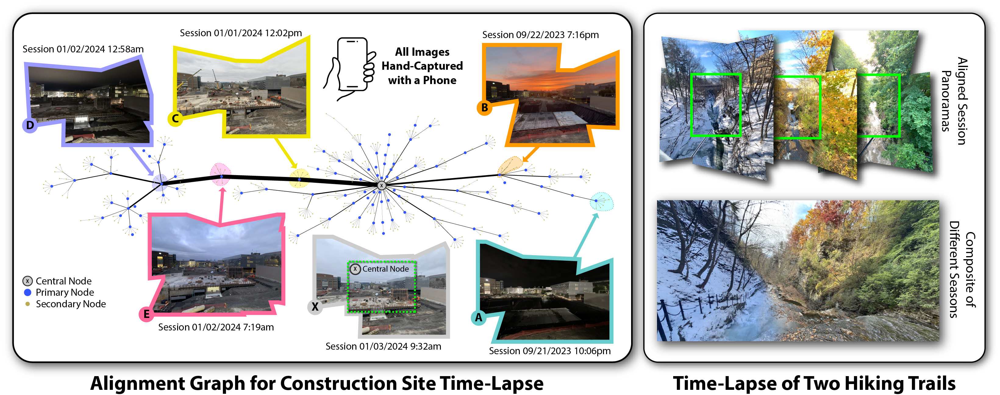

# Pocket Time-Lapse

**Pocket Time-Lapse** \
Eric M. Chen, Žiga Kovačič, Madhav Aggarwal, Abe Davis

*Most smartphone users carry a pocket-sized camera with them almost everywhere they go. However, most of the pictures we take focus on sudden salient events, leaving slower, more subtle visual changes in our environment comparatively under-sampled. 
This paper focuses on a simple but powerful idea: How can we leverage the mobile phone we already carry to capture and visualize slower, long-term changes in our environment? Answering this question has broad implications---not just for personal photography, but for many other applications that rely on long-term visual observation in uncontrolled settings, including scientific fieldwork, agriculture, construction, and structural health monitoring. With this broad range of applications in mind, we spent several years collecting what we call Pocket Time-Lapse. The idea of Pocket Time-Lapse is to use a mobile phone to capture consistent panoramic viewpoints of a scene over long periods by integrating quick and convenient data capture into users' daily routines. Over time, we collect and register this data to reconstruct a time-lapse, offering a powerful way to visualize long-term changes in the scene.*